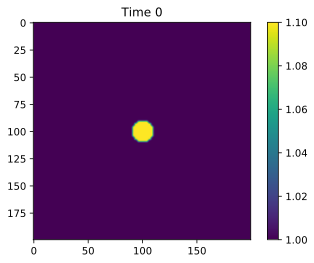
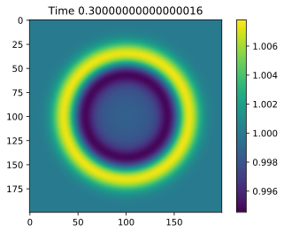

Shallow water equations
=======================

This is an example how ``sparsegrad`` can be used to generate Jacobian
of finite element system of three coupled equations. It includes
comparison of performance with state-of-the-art automatic
differentiation library ADOL-C.

The model solved is:

:math:`\frac{\partial (\rho \eta) }{\partial t} + \frac{\partial (\rho \eta u)}{\partial x} + \frac{\partial (\rho \eta v)}{\partial y} = 0`

:math:`\frac{\partial (\rho \eta u)}{\partial t} + \frac{\partial}{\partial x}\left( \rho \eta u^2 + \frac{1}{2}\rho g \eta^2 \right) + \frac{\partial (\rho \eta u v)}{\partial y} = 0`

:math:`\frac{\partial (\rho \eta v)}{\partial t} + \frac{\partial (\rho \eta uv)}{\partial x} + \frac{\partial}{\partial y}\left(\rho \eta v^2 + \frac{1}{2}\rho g \eta ^2\right) = 0`

with :math:`\rho = 1`.

For simplicity, upwinding is not included.

See `examples/shallow-water.rst` for a complete version of this example.

.. code:: python3

    %matplotlib inline
    import scipy.sparse.linalg 
    import pylab as plt
    from sparsegrad.base import *
    from sparsegrad.forward import *
    import numpy as np

.. code:: python3

    class mesh:
        """Rectangular mesh of size (n,n) with grid_spacing, providing cell centered
        d_dx and d_dy operators"""
        def __init__(self,n,grid_spacing):
            self.n=n
            self.grid_spacing=grid_spacing
            self.ndof=n*n
            self.idx=np.zeros((n,n),dtype=int)
            self.idx.ravel()[:]=np.arange(self.ndof)
            x,y = np.mgrid[:n,:n]
            self.x = x.flatten()
            self.y = y.flatten()
            
            def deriv_op(axis):
                idx_p=np.roll(self.idx,-1,axis).flatten()
                idx_m=np.roll(self.idx,1,axis).flatten()
                def d(x):
                    return (x[idx_p]-x[idx_m])/(2*grid_spacing)
                return d
            self.d_dx = deriv_op(0)
            self.d_dy = deriv_op(1)
            
        def twodim(self,x):
            x2=np.zeros((self.n,self.n))
            x2.ravel()[:]=x
            return x2
            
        def zeros(self):
            return np.zeros(self.ndof)
    
    def timestep(residuals,xold,dt,tol,ltol=1e-5,verbose=False):
        "Timestep solver using Newton's method with bicgstab"
        x=xold.copy()
        for i in range(1,10):
            adx=forward.seed(x)
            adxt = (adx-xold)/dt
            adf=residuals(adx,adxt)
            f,df=adf.value,adf.dvalue
            fnorm=np.linalg.norm(f)
            if verbose:
                print('\tNonlinear iteration {i}, |F|={f}'.format(i=i,f=fnorm))
            if fnorm<tol:
                if verbose:
                    print('Converged')
                return x
            def callback(*args):
                pass
            delta,status=scipy.sparse.linalg.bicgstab(scipy.sparse.linalg.aslinearoperator(df),-f,callback=callback,
                                                     tol=np.linalg.norm(f)*ltol)
            if status:
                raise RuntimeError('linear solver did not converge to tolerance{ltol}'.format(ltol=ltol))
            x+=delta
        raise RuntimeError('did not converge to tolerance {tol}'.format(tol))

Solution of example problem
---------------------------

.. code:: python3

    class shallow_water:
        def __init__(self,n,box_size=1.):
            self.box_size = box_size
            self.n = n
            self.mesh = mesh(n, box_size/n)
            self.g = 1
            
        def fields_to_x(self,eta,u,v):
            return stack(eta,u,v)
        
        def x_to_fields(self,x):
            m=self.mesh
            return x[:m.ndof],x[m.ndof:2*m.ndof],x[2*m.ndof:]
        
        def residuals(self,x,xt):
            m,g=self.mesh,self.g
            d_dx,d_dy=m.d_dx,m.d_dy
            eta,u,v=self.x_to_fields(x)
            deta_dt = -d_dx(eta*u) - d_dy(eta*v)
            du_dt = (deta_dt*u - d_dx(eta*u**2 + 1./2*g*eta**2) - d_dy(eta*u*v)) / eta
            dv_dt = (deta_dt*v - d_dx(eta*u*v) - d_dy(eta*v**2 + 1./2*g*eta**2)) / eta
            return xt-self.fields_to_x(deta_dt,du_dt,dv_dt)
        
        def initial_conditions(self,r=10):
            m,n=self.mesh,self.n
            eta = np.where((m.x-n/2)**2+(m.y-n/2)**2<r**2,1.1,1)
            return self.fields_to_x(eta, m.zeros(), m.zeros())   
        
        def imshow(self,plt,x):
            plt.imshow(self.mesh.twodim(self.x_to_fields(x)[0]),interpolation='bicubic')

.. code:: python3

    test_problem=shallow_water(200)

.. code:: python3

    dt=0.005
    time=0
    x0=test_problem.initial_conditions()
    x=x0
    for i in range(60):
        print('Timestep {i} at time {time} with dt {dt}'.format(i=i,time=time,dt=dt))
        x=timestep(test_problem.residuals,x,dt,1e-2)
        time+=dt

.. parsed-literal::

    Timestep 0 at time 0 with dt 0.005
    Timestep 1 at time 0.005 with dt 0.005
    Timestep 2 at time 0.01 with dt 0.005
    Timestep 3 at time 0.015 with dt 0.005
    Timestep 4 at time 0.02 with dt 0.005
    Timestep 5 at time 0.025 with dt 0.005
    Timestep 6 at time 0.030000000000000002 with dt 0.005
    Timestep 7 at time 0.035 with dt 0.005
    Timestep 8 at time 0.04 with dt 0.005
    Timestep 9 at time 0.045 with dt 0.005
    Timestep 10 at time 0.049999999999999996 with dt 0.005
    Timestep 11 at time 0.05499999999999999 with dt 0.005
    Timestep 12 at time 0.05999999999999999 with dt 0.005
    Timestep 13 at time 0.06499999999999999 with dt 0.005
    Timestep 14 at time 0.06999999999999999 with dt 0.005
    Timestep 15 at time 0.075 with dt 0.005
    Timestep 16 at time 0.08 with dt 0.005
    Timestep 17 at time 0.085 with dt 0.005
    Timestep 18 at time 0.09000000000000001 with dt 0.005
    Timestep 19 at time 0.09500000000000001 with dt 0.005
    Timestep 20 at time 0.10000000000000002 with dt 0.005
    Timestep 21 at time 0.10500000000000002 with dt 0.005
    Timestep 22 at time 0.11000000000000003 with dt 0.005
    Timestep 23 at time 0.11500000000000003 with dt 0.005
    Timestep 24 at time 0.12000000000000004 with dt 0.005
    Timestep 25 at time 0.12500000000000003 with dt 0.005
    Timestep 26 at time 0.13000000000000003 with dt 0.005
    Timestep 27 at time 0.13500000000000004 with dt 0.005
    Timestep 28 at time 0.14000000000000004 with dt 0.005
    Timestep 29 at time 0.14500000000000005 with dt 0.005
    Timestep 30 at time 0.15000000000000005 with dt 0.005
    Timestep 31 at time 0.15500000000000005 with dt 0.005
    Timestep 32 at time 0.16000000000000006 with dt 0.005
    Timestep 33 at time 0.16500000000000006 with dt 0.005
    Timestep 34 at time 0.17000000000000007 with dt 0.005
    Timestep 35 at time 0.17500000000000007 with dt 0.005
    Timestep 36 at time 0.18000000000000008 with dt 0.005
    Timestep 37 at time 0.18500000000000008 with dt 0.005
    Timestep 38 at time 0.19000000000000009 with dt 0.005
    Timestep 39 at time 0.1950000000000001 with dt 0.005
    Timestep 40 at time 0.2000000000000001 with dt 0.005
    Timestep 41 at time 0.2050000000000001 with dt 0.005
    Timestep 42 at time 0.2100000000000001 with dt 0.005
    Timestep 43 at time 0.2150000000000001 with dt 0.005
    Timestep 44 at time 0.2200000000000001 with dt 0.005
    Timestep 45 at time 0.22500000000000012 with dt 0.005
    Timestep 46 at time 0.23000000000000012 with dt 0.005
    Timestep 47 at time 0.23500000000000013 with dt 0.005
    Timestep 48 at time 0.24000000000000013 with dt 0.005
    Timestep 49 at time 0.24500000000000013 with dt 0.005
    Timestep 50 at time 0.2500000000000001 with dt 0.005
    Timestep 51 at time 0.2550000000000001 with dt 0.005
    Timestep 52 at time 0.2600000000000001 with dt 0.005
    Timestep 53 at time 0.2650000000000001 with dt 0.005
    Timestep 54 at time 0.27000000000000013 with dt 0.005
    Timestep 55 at time 0.27500000000000013 with dt 0.005
    Timestep 56 at time 0.28000000000000014 with dt 0.005
    Timestep 57 at time 0.28500000000000014 with dt 0.005
    Timestep 58 at time 0.29000000000000015 with dt 0.005
    Timestep 59 at time 0.29500000000000015 with dt 0.005

.. code:: python3

    plt.title('Time {time}'.format(time=0))
    test_problem.imshow(plt,x0)
    plt.colorbar()
    plt.show()
    plt.title('Time {time}'.format(time=time))
    test_problem.imshow(plt,x)
    plt.colorbar()
    plt.show()

Timing of automatic differentiation
-----------------------------------

.. code:: python3

    %timeit test_problem.residuals(x,0.)

.. parsed-literal::

    2.33 ms ± 112 µs per loop (mean ± std. dev. of 7 runs, 100 loops each)

.. code:: python3

    adx=forward.seed(x)

.. code:: python3

    %timeit test_problem.residuals(adx,0.)

.. parsed-literal::

    69.4 ms ± 1.1 ms per loop (mean ± std. dev. of 7 runs, 10 loops each)

.. code:: python3

    adf=test_problem.residuals(adx,0.)

.. code:: python3

    adf.dvalue

.. parsed-literal::

    <120000x120000 sparse matrix of type '<class 'numpy.float64'>'
    	with 1280000 stored elements in Compressed Sparse Row format>

Comparison with ADOL-C
----------------------

.. code:: python3

    import adolc

.. code:: python3

    def adolc_full(x):
        adolc.trace_on(0)
        adolc_x = np.asarray(list(map(adolc.adouble,x)))
        [adolc.independent(u) for u in adolc_x]
        adolc_f=test_problem.residuals(adolc_x,0.)
        [adolc.dependent(u) for u in adolc_f]
        adolc.trace_off()
        options=np.zeros(4,dtype=int)
        f=adolc.function(0,x)
        nnz,i,j,v=adolc.colpack.sparse_jac_no_repeat(0,x,options)
        def tocsr(nnz,i,j,v):
            return scipy.sparse.csr_matrix((v,(i,j)),shape=x.shape*2)
        def repeated(x):
            f=adolc.function(0,x)
            df=tocsr(*adolc.colpack.sparse_jac_repeat(0,x,nnz,i,j,v))
            return f,df
        return f,tocsr(nnz,i,j,v),repeated

Numeric values
~~~~~~~~~~~~~~

.. code:: python3

    adolc_f,adolc_j,_=adolc_full(x)

.. code:: python3

    norm_f = np.linalg.norm(adf.value)
    norm_diff_f = np.linalg.norm(adf.value-adolc_f)
    norm_jacobian = scipy.sparse.linalg.norm(adf.dvalue)
    norm_diff_jacobian = scipy.sparse.linalg.norm(adf.dvalue-adolc_j)

.. code:: python3

    print("|delta f|/|f| = {}".format(norm_diff_f/norm_f))

.. parsed-literal::

    |delta f|/|f| = 4.351870545226969e-17

.. code:: python3

    print("|delta f'|/|f'| = {}".format(norm_diff_jacobian/norm_jacobian))

.. parsed-literal::

    |delta f'|/|f'| = 2.069537920839901e-20

Timing of ADOL-C
~~~~~~~~~~~~~~~~

.. code:: python3

    %timeit adolc_full(x)

.. parsed-literal::

    2.13 s ± 51.7 ms per loop (mean ± std. dev. of 7 runs, 1 loop each)

.. code:: python3

    _,__,adolc_repeated=adolc_full(x)

.. code:: python3

    %timeit adolc_repeated(x)

.. parsed-literal::

    142 ms ± 5.59 ms per loop (mean ± std. dev. of 7 runs, 10 loops each)

Test run on Intel(R) Xeon(R) CPU E5-2620 v4 @ 2.10GHz.
